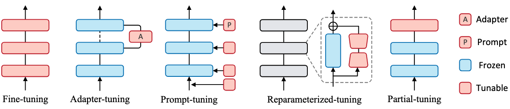
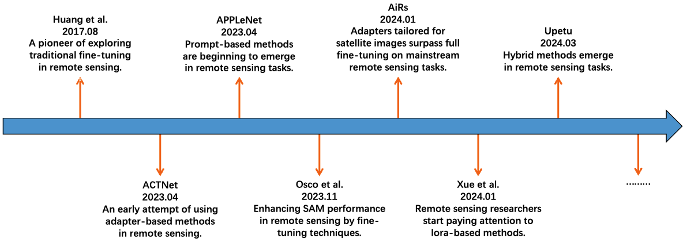
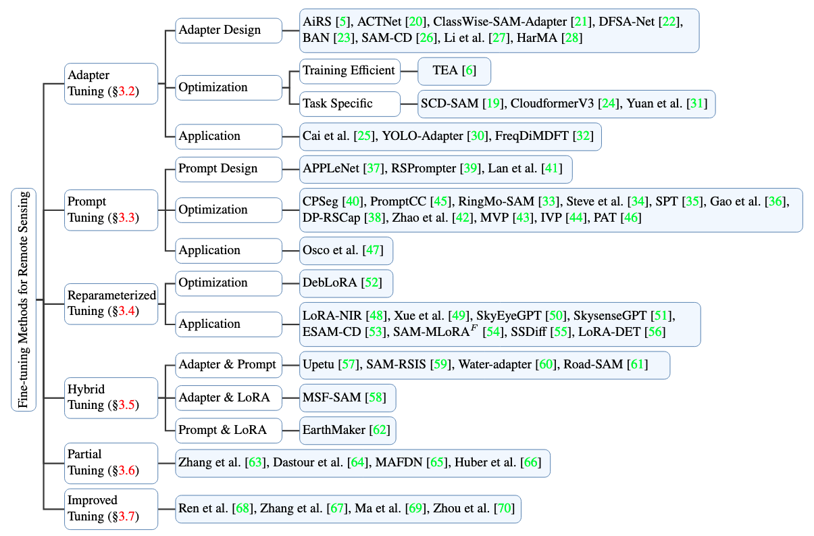

# Remote-Sensing-Tuning-A-Survey

This is a structured summary based on a survey of fine-tuning methods applied in the field of remote sensing. The methods are categorized into six main strategies, each with sub-categories and representative works.

---

## 📚 Table of Contents

- [1. Adapter Tuning](#1-adapter-tuning)
  - [1.1 Adapter Design](#11-adapter-design)
  - [1.2 Optimization](#12-optimization)
    - [1.2.1 Training Efficient](#121-training-efficient)
    - [1.2.2 Task Specific](#122-task-specific)
  - [1.3 Application](#13-application)
- [2. Prompt Tuning](#2-prompt-tuning)
  - [2.1 Prompt Design](#21-prompt-design)
  - [2.2 Optimization](#22-optimization)
  - [2.3 Application](#23-application)
- [3. Reparameterized Tuning](#3-reparameterized-tuning)
  - [3.1 Optimization](#31-optimization)
  - [3.2 Application](#32-application)
- [4. Hybrid Tuning](#4-hybrid-tuning)
  - [4.1 Adapter & Prompt](#41-adapter--prompt)
  - [4.2 Adapter & LoRA](#42-adapter--lora)
  - [4.3 Prompt & LoRA](#43-prompt--lora)
- [5. Partial Tuning](#5-partial-tuning)
- [6. Improved Tuning](#6-improved-tuning)

---

## 1. Adapter Tuning

### 1.1 Adapter Design

- AiRS: Adapter in remote sensing for parameter-efficient transfer learning. [pdf](https://ieeexplore.ieee.org/abstract/document/10385180) 
- ACTNet: A dualattention adapter with a CNN-transformer network for the semantic segmentation of remote sensing imagery. [pdf](https://www.mdpi.com/2072-4292/15/9/2363) 
- ClassWise-SAM-Adapter: Parameter efficient fine-tuning adapts segment anything to sar domain for semantic segmentation. [pdf](https://arxiv.org/abs/2401.02326)  
- DFSA-Net: Disentangled Foreground-Semantic Adapter Network for Generalized Aerial Image Few-Shot Semantic Segmentation. [pdf](https://ieeexplore.ieee.org/abstract/document/10689362)  
- BAN: A new learning paradigm for foundation model-based remote-sensing change detection. [pdf](https://ieeexplore.ieee.org/abstract/document/10438490) 
- SAM-CD: Adapting Segment Anything Model for Change Detection in VHR Remote Sensing Images. [pdf](https://ieeexplore.ieee.org/abstract/document/10443350) 
- Li et al. Algal Bed Region Segmentation Based on a ViT Adapter Using Aerial Images for Estimating CO2 Absorption Capacity. [pdf](https://ui.adsabs.harvard.edu/abs/2024RemS...16.1742L/abstract)  
- HarMA: Efficient Remote Sensing with Harmonized Transfer Learning and Modality Alignment. [pdf](https://arxiv.org/abs/2404.18253)   

### 1.2 Optimization

#### 1.2.1 Training Efficient

- TEA: A Training-Efficient Adapting Framework for Tuning Foundation Models in Remote Sensing. [pdf](https://ieeexplore.ieee.org/document/10740309)  

#### 1.2.2 Task Specific

- SCD-SAM: Adapting Segment Anything Model for Semantic Change Detection in Remote Sensing Imagery. [pdf](https://ieeexplore.ieee.org/document/10543161) 
- CloudformerV3: Multi-scale adapter and multi-level large window attention for cloud detection. [pdf](https://www.mdpi.com/2076-3417/13/23/12857)  
- Yuan et al.: Parameter-Efficient Transfer Learning for Remote Sensing Image–Text Retrieval. [pdf](https://arxiv.org/pdf/2308.12509)  

### 1.3 Application

- Cai et al.: Additional Self-Attention Transformer With Adapter for Thick Haze Removal. [pdf](https://ieeexplore.ieee.org/abstract/document/10443626)  
- YOLO-Adapter: A Fast Adaptive One-Stage Detector for Non-Aligned Visible-Infrared Object Detection. [pdf](https://ieeexplore.ieee.org/abstract/document/10508329) 
- FreqDiMDFT: Frequency-Aware Multi-Modal Fine-Tuning for Few-Shot Open-Set Remote Sensing Scene Classification. [pdf](https://ieeexplore.ieee.org/abstract/document/10461100)   

---

## 2. Prompt Tuning

### 2.1 Prompt Design

- APPLeNet: Visual Attention Parameterized Prompt Learning for Few-Shot Remote Sensing Image Generalization using CLIP. [pdf](https://openaccess.thecvf.com/content/CVPR2023W/EarthVision/html/Jha_APPLeNet_Visual_Attention_Parameterized_Prompt_Learning_for_Few-Shot_Remote_Sensing_CVPRW_2023_paper.html)   
- RSPrompter: Learning to Prompt for Remote Sensing Instance Segmentation Based on Visual Foundation Model. [pdf](https://ieeexplore.ieee.org/abstract/document/10409216)  
- Lan et al.: Efficient Prompt Tuning of Large Vision-Language Model for Fine-Grained Ship Classification. [pdf](https://arxiv.org/abs/2403.08271)  

### 2.2 Optimization

- CPSeg: Finer-grained Image Semantic Segmentation via Chain-of-Thought Language Prompting. [pdf](https://openaccess.thecvf.com/content/WACV2024/html/Li_CPSeg_Finer-Grained_Image_Semantic_Segmentation_via_Chain-of-Thought_Language_Prompting_WACV_2024_paper.html)  
- PromptCC: A Decoupling Paradigm With Prompt Learning for Remote Sensing Image Change Captioning. [pdf](https://ieeexplore.ieee.org/abstract/document/10271701)  
- RingMo-SAM: A Foundation Model for Segment Anything in Multimodal Remote-Sensing Images. [pdf](https://ieeexplore.ieee.org/abstract/document/10315957)  
- Steve et al.: Learnable Prompt for Few-Shot Semantic Segmentation in Remote Sensing Domain. [pdf](https://openaccess.thecvf.com/content/CVPR2024W/L3D-IVU/html/Immanuel_Learnable_Prompt_for_Few-Shot_Semantic_Segmentation_in_Remote_Sensing_Domain_CVPRW_2024_paper.html)  
- SPT: Joint Classification of Hyperspectral Image and LiDAR Data Based on Spectral Prompt Tuning. [pdf](https://ieeexplore.ieee.org/abstract/document/10568205)  
- Gao et al.: Attention Prompt-Driven Source-Free Adaptation for Remote Sensing Images Semantic Segmentation. [pdf](https://ieeexplore.ieee.org/abstract/document/10583928)  
- DP-RSCap: Dual Prompt-Based Scene and Entity Network for Remote Sensing Image Captioning. [pdf](https://ieeexplore.ieee.org/abstract/document/10641565)   
- Zhao et al.: Continual Learning for Remote Sensing Image Scene Classification With Prompt Learning. [pdf](https://ieeexplore.ieee.org/abstract/document/10304174)  
- MVP: Meta Visual Prompt Tuning for Few-Shot Remote Sensing Image Scene Classification. [pdf](https://ieeexplore.ieee.org/abstract/document/10416176)  
- IVP: Rethinking Remote Sensing Pretrained Model: Instance-Aware Visual Prompting for Remote Sensing Scene Classification. [pdf](https://ieeexplore.ieee.org/abstract/document/10328642)  
- PAT: Prompt-and-Transfer: Dynamic Class-Aware Enhancement for Few-Shot Segmentation. [pdf](https://ieeexplore.ieee.org/abstract/document/10681253)   

### 2.3 Application

- Osco et al.: The Segment Anything Model (SAM) for Remote Sensing Applications: From Zero to One Shot. [pdf](https://www.sciencedirect.com/science/article/pii/S1569843223003643)   

---

## 3. Reparameterized Tuning

### 3.1 Optimization

- DebLoRA: Learning De-Biased Representations for Remote-Sensing Imagery. [pdf](https://arxiv.org/pdf/2410.04546)   

### 3.2 Application

- LoRA-NIR: Low-Rank Adaptation of Vision Transformers for Remote Sensing With Near-Infrared Imagery. [pdf](https://ieeexplore.ieee.org/abstract/document/10646393)  
- Xue et al.: Adapting Segment Anything Model to Aerial Land Cover Classification With Low-Rank Adaptation. [pdf](https://ieeexplore.ieee.org/abstract/document/10412208)  
- SkyEyeGPT: Unifying Remote Sensing Vision-Language Tasks via Instruction Tuning with Large Language Model. [pdf](https://arxiv.org/abs/2401.09712)  
- SkysenseGPT: A Fine-Grained Instruction Tuning Dataset and Model for Remote Sensing Vision-Language Understanding. [pdf](https://arxiv.org/abs/2406.10100)  
- ESAM-CD: Fine-Tuned EfficientSAM Network With LoRA for Weakly Supervised Remote Sensing Image Change Detection. [pdf](https://ieeexplore.ieee.org/abstract/document/10700770)  
- SAM-MLoRA: Multi-LoRA Fine-Tuned Segment Anything Model for Urban Man-Made Object Extraction. [pdf](https://ieeexplore.ieee.org/abstract/document/10637992)   
- SSDiff: Spatial-spectral Integrated Diffusion Model for Remote Sensing Pansharpening. [pdf](https://arxiv.org/pdf/2404.11537)  
- LoRA-DET: Low-Rank Adaption on Transformer-based Oriented Object Detector for Satellite Onboard Processing of Remote Sensing Images. [pdf](https://arxiv.org/abs/2406.02385)  

---

## 4. Hybrid Tuning

### 4.1 Adapter & Prompt

- Upetu:  A unified parameter-efficient fine-tuning framework for remote sensing foundation model. [pdf](https://ieeexplore.ieee.org/abstract/document/10485462)  
- SAM-RSIS: Progressively Adapting SAM With Box Prompting to Remote Sensing Image Instance Segmentation. [pdf](https://ieeexplore.ieee.org/abstract/document/10680168)  
- Water-adapter: adapting the segment anything model for surface water extraction in optical very-high-resolution remotely sensed imagery. [pdf](https://www.tandfonline.com/doi/abs/10.1080/2150704X.2024.2411067)   
- Road-SAM: Adapting the Segment Anything Model to Road Extraction From Large Very-High-Resolution Optical Remote Sensing Images. [pdf](https://ieeexplore.ieee.org/abstract/document/10613866)    

### 4.2 Adapter & LoRA

- MSF-SAM: A Multispectral Remote Sensing Crop Segmentation Method Based on Segment Anything Model Using Multistage Adaptation Fine-Tuning. [pdf](https://ieeexplore.ieee.org/abstract/document/10551868)  

### 4.3 Prompt & LoRA

- EarthMaker: A Visual Prompting Multi-modal Large Language Model for Remote Sensing. [pdf](https://arxiv.org/pdf/2407.13596)   

---

## 5. Partial Tuning

- Zhang et al.: Improving pre-training and finetuning for few-shot sar automatic target recognition. [pdf](https://www.mdpi.com/2072-4292/15/6/1709)  
- Dastour et al.:  A comparison of deep transfer learning methods for land use and land cover classification. [pdf](https://www.mdpi.com/2071-1050/15/10/7854)  
- MAFDN: A deep transfer learning model for green environment security analysis in smart city. [pdf](https://www.sciencedirect.com/science/article/pii/S1319157824000107)  
- Huber et al.:Leveraging Remote Sensing Data for Yield Prediction with Deep Transfer Learning. [pdf](https://www.mdpi.com/1424-8220/24/3/770)  

---

## 6. Improved Tuning

- Ren et al.: A Novel Adaptive Fine-Tuning Algorithm for Multimodal Models: Self-Optimizing Classification and Selection of High-Quality Datasets in Remote Sensing. [pdf](https://arxiv.org/abs/2409.13345)  
- Zhang et al.: Generalized few-shot object detection in remote sensing images. [pdf](https://www.sciencedirect.com/science/article/pii/S0924271622003197)   
- Ma et al.: SAM-Assisted Remote Sensing Imagery Semantic Segmentation with Object and Boundary Constraints. [pdf](https://arxiv.org/pdf/2312.02464)     
- Zhou et al.: Multiscale Enhanced Segment Anything Model for Optical Remote Sensing Images. [pdf](https://ieeexplore.ieee.org/abstract/document/10522788) 